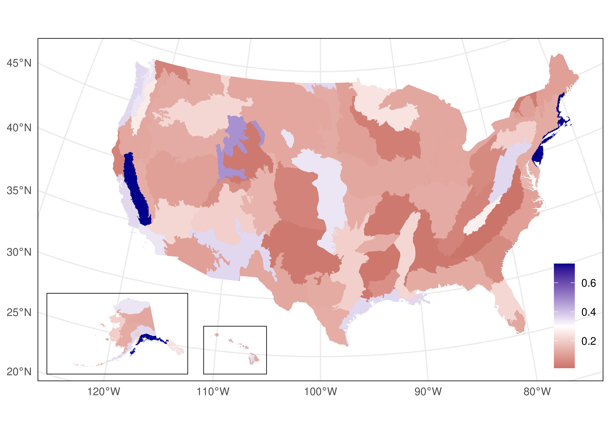
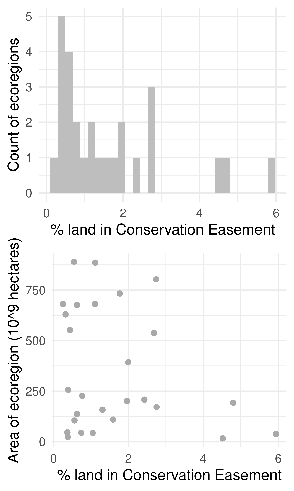
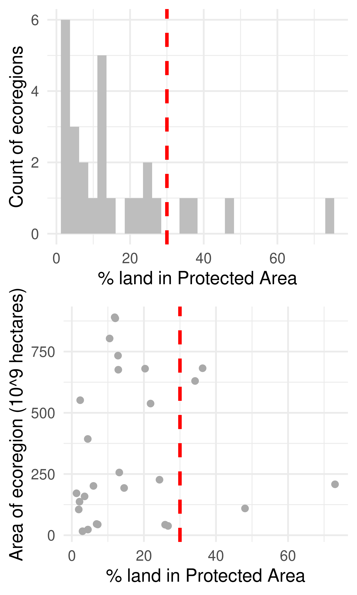

ecoregion-maps
================

``` r
#download.file("https://www.sciencebase.gov/catalog/file/get/5b030c7ae4b0da30c1c1d6de?f=__disk__97%2F0a%2F32%2F970a32899eb4389aaf8b3abf61b6bc7fde229df8", "../data/padus.zip")
#unzip("../data/padus.zip", "../data/")
```

``` r
library(sf)
```

    ## Linking to GEOS 3.8.0, GDAL 3.0.4, PROJ 6.3.1

``` r
library(tidyverse)
```

    ## ── Attaching packages ─────────────────────────────────────── tidyverse 1.3.0 ──

    ## ✓ ggplot2 3.3.2     ✓ purrr   0.3.4
    ## ✓ tibble  3.0.4     ✓ dplyr   1.0.2
    ## ✓ tidyr   1.1.2     ✓ stringr 1.4.0
    ## ✓ readr   1.4.0     ✓ forcats 0.5.0

    ## ── Conflicts ────────────────────────────────────────── tidyverse_conflicts() ──
    ## x dplyr::filter() masks stats::filter()
    ## x dplyr::lag()    masks stats::lag()

``` r
#install.packages("viridis")  # Install
library("viridis")  
```

    ## Loading required package: viridisLite

``` r
#ecoregions <- st_read("../data/ecoregions/tnc_terr_ecoregions.shp")
#usa <- st_read("../data/USshp/gadm36_USA_0.shp")
#ecoregions_us <- st_intersection(st_buffer(ecoregions,0), st_buffer(usa, 0))
#saveRDS(ecoregions_us, "../data/outputs/ecoregions_us.rds")
```

``` r
ecoregions_us <- readRDS("../data/outputs/ecoregions_us.rds")
```

``` r
ecoregions_us$area <- st_area(ecoregions_us)


ecoregions_join <- ecoregions_us %>%
  select(ECO_NUM, ECO_NAME, area) %>%
  group_by(ECO_NUM) %>%
  summarise(area = sum(area))
```

    ## `summarise()` ungrouping output (override with `.groups` argument)

``` r
ce_eco <- readRDS("../data/outputs/ce_eco.rds")
pa_eco <-readRDS("../data/outputs/pa_eco.rds")
ecoregion_easements <- as.tibble(ce_eco) %>%
  mutate(area = as.numeric(st_area(ce_eco))) %>%
  group_by(ECO_NUM) %>%
  summarise(area_ce = sum(area))
```

    ## Warning: `as.tibble()` is deprecated as of tibble 2.0.0.
    ## Please use `as_tibble()` instead.
    ## The signature and semantics have changed, see `?as_tibble`.
    ## This warning is displayed once every 8 hours.
    ## Call `lifecycle::last_warnings()` to see where this warning was generated.

    ## `summarise()` ungrouping output (override with `.groups` argument)

``` r
ecoregion_protection <- as.tibble(pa_eco) %>%
  mutate(area = as.numeric(st_area(pa_eco))) %>%
  group_by(ECO_NUM) %>%
  summarise(area_pa = sum(area)) %>%
  full_join(ecoregion_easements)
```

    ## `summarise()` ungrouping output (override with `.groups` argument)

    ## Joining, by = "ECO_NUM"

``` r
ecoregions_joined <- ecoregion_protection %>%
  full_join(ecoregions_join) %>%
  mutate(area = as.numeric(area),
         perc_pa = area_pa/area,
         perc_ce = area_ce/area) %>%
  mutate(perc_ce = as.numeric(perc_ce),
         perc_pa = as.numeric(perc_pa))
```

    ## Joining, by = "ECO_NUM"

``` r
ecoregions_plot <- ecoregions_us %>%
  select(ECO_NUM, geometry) %>%
  right_join(ecoregions_joined)
```

    ## Joining, by = c("ECO_NUM", "geometry")

``` r
mainland_pa <- ggplot() + 
 # geom_sf(data = usa, fill = "#DCDCDC", lwd = 1)+
  geom_sf(data = ecoregions_plot, aes(geometry = geometry, fill = perc_pa), lwd = 0) +
 # geom_sf(data = wdpa_map, fill = "#E69F00",lwd = 0) +
 # scale_color_viridis(discrete = TRUE, option = "D")+
  #scale_fill_viridis(discrete = FALSE) +
  coord_sf(crs = st_crs(2163), xlim = c(-2500000, 2500000), ylim = c(-2300000, 
         730000))+ theme_minimal() +
  theme(panel.border = element_rect(colour = "black", fill=NA)) +
  scale_fill_gradient2(low = "brown", mid = "white", high = "darkblue", midpoint = 0.30) +
  theme(legend.position = c(0.95, 0.2), legend.title = element_blank())

mainland_ce <- ggplot() + 
 # geom_sf(data = usa, fill = "#DCDCDC", lwd = 1)+
  geom_sf(data = ecoregions_plot, aes(geometry = geometry, fill = perc_ce), lwd = 0) +
 # geom_sf(data = wdpa_map, fill = "#E69F00",lwd = 0) +
 # scale_color_viridis(discrete = TRUE, option = "D")+
  #scale_fill_viridis(discrete = FALSE) +
  coord_sf(crs = st_crs(2163), xlim = c(-2500000, 2500000), ylim = c(-2300000, 
         730000))+ theme_minimal() +
  theme(panel.border = element_rect(colour = "black", fill=NA)) +
  scale_fill_gradient2(low = "brown", mid = "white", high = "darkblue", midpoint = 0.030)  +
  theme(legend.position = c(0.95, 0.2), legend.title = element_blank())
```

``` r
alaska_pa <- ggplot() +
  geom_sf(data = ecoregions_plot, aes(geometry = geometry, fill = perc_pa), lwd = 0) +
     #geom_sf(data = wdpa_map, fill = "#E69F00", lwd = 0, alpha = 0.5) +
     coord_sf(crs = st_crs(3467), xlim = c(-2400000, 1600000), ylim = c(200000, 
         2500000), expand = FALSE, datum = NA) +theme_minimal() +
   theme(panel.border = element_rect(colour = "black", fill=NA)) +
    theme(legend.position = "none") +
  scale_fill_gradient2(low = "brown", mid = "white", high = "darkblue", midpoint = 0.30) 


hawaii_pa  <- ggplot() +
    geom_sf(data = ecoregions_plot, aes(geometry = geometry, fill = perc_pa), lwd = 0) +
       #geom_sf(data = wdpa_map, fill = "#E69F00", color = "#E69F00") +
     coord_sf(crs = st_crs(4135), xlim = c(-161, -154), ylim = c(18, 
         23), expand = FALSE, datum = NA) +theme_minimal() +
     theme(panel.border = element_rect(colour = "black", fill=NA)) +  
    theme(legend.position = "none") +
  scale_fill_gradient2(low = "brown", mid = "white", high = "darkblue", midpoint = 0.30) 
```

``` r
mainland_pa +
 annotation_custom(
      grob = ggplotGrob(alaska_pa),
      xmin = -2800000,
      xmax = -2750000 + (1600000 - (-2400000))/2.5,
      ymin = -2450000,
      ymax = -2450000 + (2500000 - 200000)/2.5
  ) +
  annotation_custom(
      grob = ggplotGrob(hawaii_pa),
      xmin = -1250000,
      xmax = -1250000 + (-154 - (-161))*120000,
      ymin = -2450000,
      ymax = -2450000 + (23 - 18)*120000
  )
```

<!-- -->

``` r
alaska_ce <- ggplot() +
  geom_sf(data = ecoregions_plot, aes(geometry = geometry, fill = perc_ce), lwd = 0) +
     #geom_sf(data = wdpa_map, fill = "#E69F00", lwd = 0, alpha = 0.5) +
     coord_sf(crs = st_crs(3467), xlim = c(-2400000, 1600000), ylim = c(200000, 
         2500000), expand = FALSE, datum = NA) +theme_minimal() +
   theme(panel.border = element_rect(colour = "black", fill=NA)) +
    theme(legend.position = "none") +
  scale_fill_gradient2(low = "brown", mid = "white", high = "darkblue", midpoint = 0.30) 


hawaii_ce  <- ggplot() +
    geom_sf(data = ecoregions_plot, aes(geometry = geometry, fill = perc_ce), lwd = 0) +
       #geom_sf(data = wdpa_map, fill = "#E69F00", color = "#E69F00") +
     coord_sf(crs = st_crs(4135), xlim = c(-161, -154), ylim = c(18, 
         23), expand = FALSE, datum = NA) +theme_minimal() +
     theme(panel.border = element_rect(colour = "black", fill=NA)) +  
    theme(legend.position = "none") +
  scale_fill_gradient2(low = "brown", mid = "white", high = "darkblue", midpoint = 0.30) 
```

``` r
mainland_ce +
 annotation_custom(
      grob = ggplotGrob(alaska_ce),
      xmin = -2800000,
      xmax = -2750000 + (1600000 - (-2400000))/2.5,
      ymin = -2450000,
      ymax = -2450000 + (2500000 - 200000)/2.5
  ) +
  annotation_custom(
      grob = ggplotGrob(hawaii_ce),
      xmin = -1250000,
      xmax = -1250000 + (-154 - (-161))*120000,
      ymin = -2450000,
      ymax = -2450000 + (23 - 18)*120000
  )
```

<!-- -->

``` r
c <- ecoregions_plot %>%
  ggplot(aes(x = perc_ce*100)) + 
  geom_histogram(fill="grey") +
  theme_minimal() +
  xlab("% land in Conservation Easement") + ylab("Count of ecoregions")

d <-ecoregions_plot %>%
  ggplot(aes(x = perc_ce*100, y =area/10^9)) + 
  geom_point(color="darkgrey") + theme_minimal() +
  xlab("% land in Conservation Easement") + 
  ylab("Area of ecoregion (10^9 hectares)")

e <- ecoregions_plot %>%
  ggplot(aes(x = perc_pa*100)) + 
  geom_histogram(fill="grey") + theme_minimal() +
  geom_vline(xintercept=30, linetype="dashed", 
                color = "red", size=1) +
  xlab("% land in Protected Area") + ylab("Count of ecoregions")

f <- ecoregions_plot %>%
  ggplot(aes(x = perc_pa*100, y =area/10^9)) + 
  geom_point(color="darkgrey") + theme_minimal() +
  geom_vline(xintercept=30, linetype="dashed", 
                color = "red", size=1) +
  xlab("% land in Protected Area") + 
  ylab("Area of ecoregion (10^9 hectares)")
```

``` r
library(gridExtra)
```

    ## 
    ## Attaching package: 'gridExtra'

    ## The following object is masked from 'package:dplyr':
    ## 
    ##     combine

``` r
grid.arrange(c, d, nrow = 2)
```

    ## `stat_bin()` using `bins = 30`. Pick better value with `binwidth`.

    ## Warning: Removed 2 rows containing non-finite values (stat_bin).

    ## Warning: Removed 2 rows containing missing values (geom_point).

<!-- -->

``` r
grid.arrange(e, f, nrow = 2)
```

    ## `stat_bin()` using `bins = 30`. Pick better value with `binwidth`.

    ## Warning: Removed 2 rows containing non-finite values (stat_bin).

    ## Warning: Removed 2 rows containing missing values (geom_point).

<!-- -->
