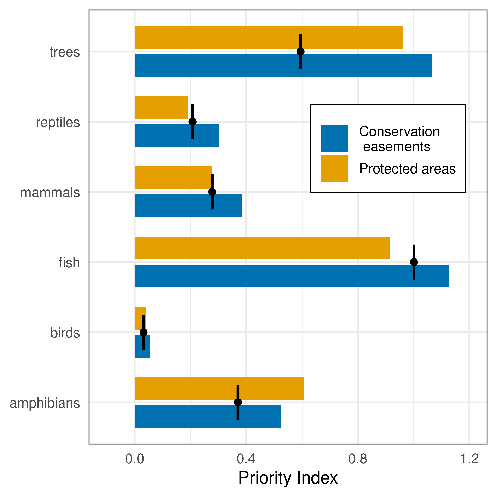
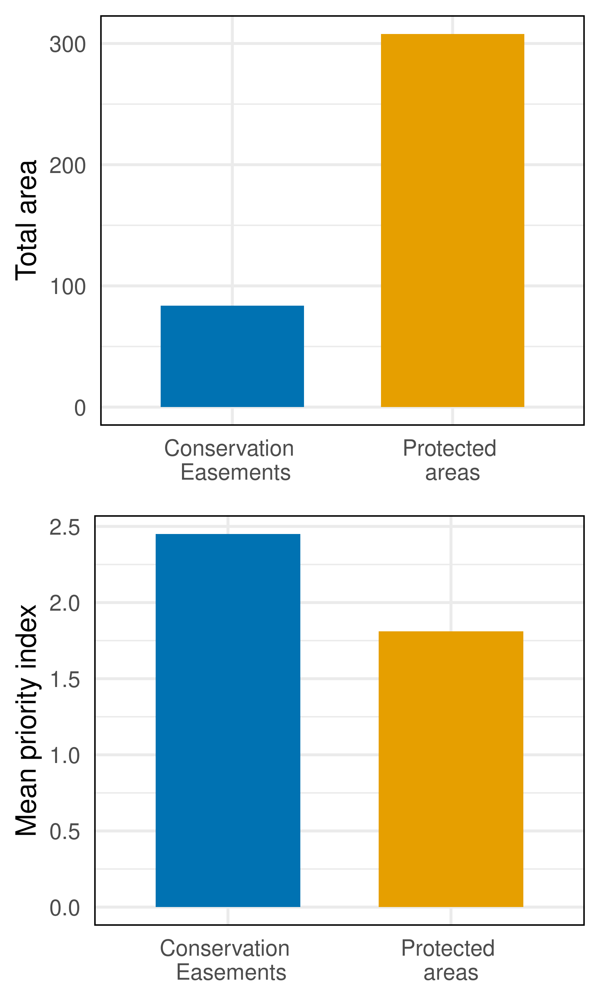
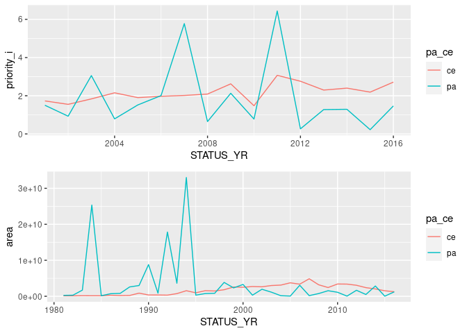
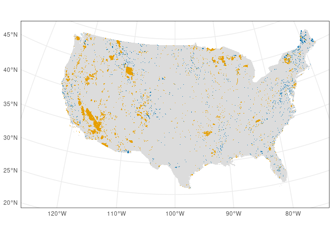
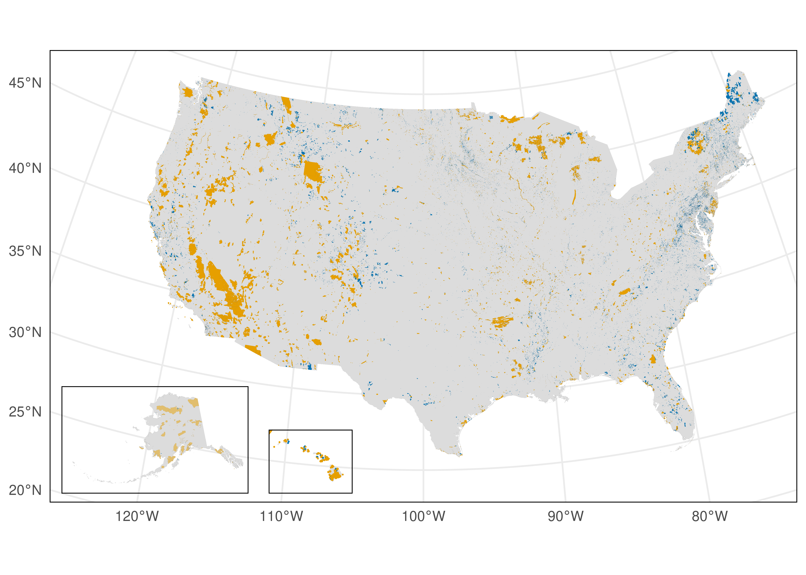

plots
================

``` r
library(tidyverse)
```

    ## ── Attaching packages ─────────────────────────────────────────────────────────────────────────────────────────── tidyverse 1.3.0 ──

    ## ✓ ggplot2 3.3.2     ✓ purrr   0.3.4
    ## ✓ tibble  3.0.3     ✓ dplyr   1.0.2
    ## ✓ tidyr   1.1.2     ✓ stringr 1.4.0
    ## ✓ readr   1.3.1     ✓ forcats 0.5.0

    ## ── Conflicts ────────────────────────────────────────────────────────────────────────────────────────────── tidyverse_conflicts() ──
    ## x dplyr::filter() masks stats::filter()
    ## x dplyr::lag()    masks stats::lag()

``` r
library(sf)
```

    ## Linking to GEOS 3.8.0, GDAL 3.0.4, PROJ 6.3.1

``` r
library(gridExtra)
```

    ## 
    ## Attaching package: 'gridExtra'

    ## The following object is masked from 'package:dplyr':
    ## 
    ##     combine

``` r
all_critters <- read_csv("../data/all_critters_output2.csv")
```

    ## Parsed with column specification:
    ## cols(
    ##   X1 = col_double(),
    ##   pa_ce = col_character(),
    ##   priority_i = col_double(),
    ##   area = col_double(),
    ##   crit = col_character()
    ## )

``` r
pa_priority <- st_read("../data/pa_priority.shp")
```

    ## Reading layer `pa_priority' from data source `/home/millie/wdpa/wdpa-hotspots/data/pa_priority.shp' using driver `ESRI Shapefile'
    ## Simple feature collection with 43301 features and 37 fields
    ## geometry type:  MULTIPOLYGON
    ## dimension:      XY
    ## bbox:           xmin: -2356104 ymin: -1319673 xmax: 2250533 ymax: 1557003
    ## projected CRS:  USA_Contiguous_Albers_Equal_Area_Conic

``` r
ce_priority <- st_read("../data/ce_priority.shp")
```

    ## Reading layer `ce_priority' from data source `/home/millie/wdpa/wdpa-hotspots/data/ce_priority.shp' using driver `ESRI Shapefile'
    ## Simple feature collection with 178292 features and 45 fields
    ## geometry type:  MULTIPOLYGON
    ## dimension:      XY
    ## bbox:           xmin: -2348450 ymin: -1294995 xmax: 2255442 ymax: 1556916
    ## projected CRS:  USA_Contiguous_Albers_Equal_Area_Conic

``` r
all_critters %>% filter(pa_ce == "Protected areas" | pa_ce == "Conservation Easements")
```

    ## # A tibble: 12 x 5
    ##       X1 pa_ce                  priority_i          area crit      
    ##    <dbl> <chr>                       <dbl>         <dbl> <chr>     
    ##  1     1 Protected areas            0.0422 149100692854. birds     
    ##  2     2 Conservation Easements     0.0560  58344508722. birds     
    ##  3     3 Protected areas            0.190  164455002058. reptiles  
    ##  4     4 Conservation Easements     0.301   54608030134. reptiles  
    ##  5     5 Protected areas            0.276  250371149164. mammals   
    ##  6     6 Conservation Easements     0.385   66729563828. mammals   
    ##  7     7 Protected areas            0.915  193548843112. fish      
    ##  8     8 Conservation Easements     1.13    62351098993. fish      
    ##  9     9 Protected areas            0.961  189236585390. trees     
    ## 10    10 Conservation Easements     1.07    57965924076. trees     
    ## 11    11 Protected areas            0.607  152387542685. amphibians
    ## 12    12 Conservation Easements     0.523   53591597734. amphibians

``` r
#devtools::install_github("wilkelab/ungeviz")
```

``` r
library(ungeviz)
```

``` r
all_us_crits <- all_critters %>% filter(pa_ce == "all")


all_critters_plot <- all_critters %>% 
  filter(pa_ce == "Protected areas" | pa_ce == "Conservation Easements") %>%
  mutate(pa_ce = recode(pa_ce, `Protected areas` = "Protected areas", `Conservation Easements` = "Conservation \n easements")) 

ggplot() + 
  scale_fill_manual(values=c("#0072B2", "#E69F00")) +
  geom_bar(all_critters_plot, mapping = aes(x= crit, y= priority_i, fill = pa_ce),
                                  stat = "identity", width=0.65,
                                  position=position_dodge(width=0.8)) +
  geom_hpline(data = all_us_crits, aes(x=crit, y =priority_i), stat = "identity", height = 0.4, lwd = .75) +
  geom_point(all_us_crits, mapping = aes(x = crit, y= priority_i), pch = 19) +
  theme_minimal() +
  theme(axis.title.y =element_blank()) +
  theme(legend.title = element_blank()) + coord_flip() +
  theme(legend.position = c(0.75, 0.68)) +ylim(0,1.2) +ylab("Priority Index") +
   theme(axis.text=element_text(size=8),
        axis.title=element_text(size=10),
        panel.border = element_rect(colour = "black", fill=NA),
        legend.box.background = element_rect(colour = "black"),
        legend.text = element_text(size = 8)) +
  guides(shape = guide_legend(override.aes = list(size = 5)))
```

    ## Warning: Ignoring unknown parameters: height

<!-- -->

``` r
 ## scale_y_continuous(0, 1, by = 0.5)
```

``` r
pa_size<- as.tibble(pa_priority) %>%
  mutate(pa_ce = "pa") %>%
  group_by(WDPAID, pa_ce) %>%
  summarise(area = sum(area),
            priority = mean(Prirty_)) %>%
  mutate(unique_id = WDPAID)
```

    ## Warning: `as.tibble()` is deprecated as of tibble 2.0.0.
    ## Please use `as_tibble()` instead.
    ## The signature and semantics have changed, see `?as_tibble`.
    ## This warning is displayed once every 8 hours.
    ## Call `lifecycle::last_warnings()` to see where this warning was generated.

    ## `summarise()` regrouping output by 'WDPAID' (override with `.groups` argument)

``` r
ce_size<- as.tibble(ce_priority) %>%
  mutate(pa_ce = "ce") %>%
  group_by(uniqu_d, pa_ce) %>%
  summarise(area = sum(area),
            priority = mean(Prirty_)) %>%
  mutate(unique_id = uniqu_d)
```

    ## `summarise()` regrouping output by 'uniqu_d' (override with `.groups` argument)

``` r
ce_size$unique_id <- as.numeric(ce_size$unique_id)
pa_size$unique_id <- as.numeric(pa_size$unique_id)

size_plot <- pa_size %>%
  bind_rows(ce_size) %>% 
  mutate(area = as.numeric(area)) %>%
  filter(priority <50)

size_plot %>% ggplot(aes(x = log(area), y = priority, col = pa_ce)) + geom_point(shape = 21,alpha = 1/5)
```

<!-- -->

``` r
pa_all<- as.tibble(pa_priority) %>%
  mutate(pa_ce = "pa",
         Priority_i = Prirty_) %>%
  group_by(pa_ce) %>%
  summarise(priority_i = sum(Priority_i*as.numeric(area)),
            area = sum(as.numeric(area)),
            .groups = "drop") %>% 
  mutate(priority_i = priority_i/area) 

ce_all<- as.tibble(ce_priority) %>%
  mutate(pa_ce = "ce",
         Priority_i = Prirty_) %>%
  group_by(pa_ce) %>%
  summarise(priority_i = sum(Priority_i*as.numeric(area)),
            area = sum(as.numeric(area)),
            .groups = "drop") %>% 
  mutate(priority_i = priority_i/area)

all_priority_i <- pa_all %>% bind_rows(ce_all) %>%
   mutate(crit = "all")
all_priority_i
```

    ## # A tibble: 2 x 4
    ##   pa_ce priority_i          area crit 
    ##   <chr>      <dbl>         <dbl> <chr>
    ## 1 pa          1.81 308062055689. all  
    ## 2 ce          2.45  83846780619. all

``` r
a <- size_plot %>% group_by(pa_ce) %>% summarise(area = sum(area)/10^9,
                                                 count = n()) %>%
  mutate(pa_ce = recode(pa_ce, pa = "Protected \nareas", ce = "Conservation \n Easements")) %>%
  ggplot(aes(x = pa_ce, y = area, fill = pa_ce)) + 
  scale_fill_manual(values=c("#0072B2", "#E69F00")) +
  geom_bar(stat = "identity", width=0.65, position=position_dodge(width=0.8)) +
  theme_minimal() +
 theme(axis.title.x =element_blank()) +
  theme(legend.title = element_blank()) + 
  theme(legend.position = "none") + ylab("Total area") +
   theme(axis.text=element_text(size=8),
        axis.title=element_text(size=10),
        panel.border = element_rect(colour = "black", fill=NA),
        legend.box.background = element_rect(colour = "black"))
```

    ## `summarise()` ungrouping output (override with `.groups` argument)

``` r
b <- all_priority_i %>%
  mutate(pa_ce = recode(pa_ce, pa = "Protected \nareas", ce = "Conservation \n Easements")) %>%
  ggplot(aes(x = pa_ce, y =priority_i, fill = pa_ce)) +geom_bar(stat = "identity") %>%
  scale_fill_manual(values=c("#0072B2", "#E69F00")) +
  geom_bar(stat = "identity", width=0.65, position=position_dodge(width=0.8)) +
  theme_minimal() +
  theme(axis.title.x =element_blank()) +
  theme(legend.title = element_blank()) + 
  theme(legend.position = "none") + ylab("Mean priority index") + 
   theme(axis.text=element_text(size=8),
        axis.title=element_text(size=10),
        panel.border = element_rect(colour = "black", fill=NA),
        legend.box.background = element_rect(colour = "black"))
```

``` r
grid.arrange(a, b, nrow = 2)
```

<!-- -->

``` r
ce_priority_i <- as.tibble(ce_priority) %>%
  mutate(year_est = year_st,
         Priority_i = Prirty_) %>%
  group_by(year_est) %>%
  summarise(priority_i = sum(Priority_i*as.numeric(area)),
            area = sum(as.numeric(area)),
            .groups = "drop") %>% 
  mutate(priority_i = priority_i/area,
         pa_ce = "ce") %>%
  rename(STATUS_YR = "year_est")
```

``` r
pa_priority_i <- as.tibble(pa_priority) %>%
  mutate(STATUS_YR = STATUS_,
         Priority_i = Prirty_) %>%
  group_by(STATUS_YR) %>%
  summarise(priority_i = sum(Priority_i*as.numeric(area)),
            area = sum(as.numeric(area)),
            .groups = "drop") %>% 
  mutate(priority_i = priority_i/area,
         pa_ce = "pa") 
```

``` r
all_yrs <- pa_priority_i %>%
  bind_rows(ce_priority_i)
all_yrs <- as.data.frame(all_yrs)

 a<- all_yrs %>% filter(STATUS_YR >2000, STATUS_YR<2017) %>%
  ggplot(aes(x = STATUS_YR, y = priority_i, col = pa_ce)) +geom_line()
 
b<- all_yrs %>% filter(STATUS_YR>1980, STATUS_YR<2017) %>%
  ggplot(aes(x = STATUS_YR, y = area, col = pa_ce)) +geom_line()

grid.arrange(a, b, ncol = 1)
```

<!-- -->

``` r
all_yrs %>% filter(STATUS_YR >1950) %>%
  group_by(pa_ce) %>%
  summarise(area = sum(area)/10^9)
```

    ## `summarise()` ungrouping output (override with `.groups` argument)

    ## # A tibble: 2 x 2
    ##   pa_ce  area
    ##   <chr> <dbl>
    ## 1 ce     66.0
    ## 2 pa    203.

``` r
wdpa_usa <- st_read("../data/wdpa/wdpa_clean_usa.shp")
```

    ## Reading layer `wdpa_clean_usa' from data source `/home/millie/wdpa/wdpa-hotspots/data/wdpa/wdpa_clean_usa.shp' using driver `ESRI Shapefile'
    ## Simple feature collection with 12695 features and 32 fields
    ## geometry type:  MULTIPOLYGON
    ## dimension:      XY
    ## bbox:           xmin: -17288410 ymin: -1939946 xmax: 16420230 ymax: 6889522
    ## CRS:            unknown

``` r
ce <- st_read("../data/NCED_12182019_Shp/Conservation_Easements.shp")
```

    ## Reading layer `Conservation_Easements' from data source `/home/millie/wdpa/wdpa-hotspots/data/NCED_12182019_Shp/Conservation_Easements.shp' using driver `ESRI Shapefile'
    ## Simple feature collection with 158078 features and 40 fields
    ## geometry type:  MULTIPOLYGON
    ## dimension:      XY
    ## bbox:           xmin: -10403400 ymin: -57047.14 xmax: 3317527 ymax: 6532636
    ## projected CRS:  USA_Contiguous_Albers_Equal_Area_Conic_USGS_version

``` r
wdpa_map <- st_transform(wdpa_usa,st_crs(2163))
ce_map <- st_transform(ce,st_crs(2163))
```

``` r
usa <- st_read("../data/usa_shp/gadm36_USA_0.shp")
```

    ## Reading layer `gadm36_USA_0' from data source `/home/millie/wdpa/wdpa-hotspots/data/usa_shp/gadm36_USA_0.shp' using driver `ESRI Shapefile'
    ## Simple feature collection with 1 feature and 2 fields
    ## geometry type:  MULTIPOLYGON
    ## dimension:      XY
    ## bbox:           xmin: -179.1506 ymin: 18.90986 xmax: 179.7734 ymax: 72.6875
    ## geographic CRS: WGS 84

``` r
mainland <- ggplot() + 
  geom_sf(data = usa, fill = "#DCDCDC", lwd = 0)+
  geom_sf(data = ce_map, fill = "#0072B2",lwd = 0) +
  geom_sf(data = wdpa_map, fill = "#E69F00",lwd = 0) +
  coord_sf(crs = st_crs(2163), xlim = c(-2500000, 2500000), ylim = c(-2300000, 
         730000))+ theme_minimal() +
  theme(panel.border = element_rect(colour = "black", fill=NA))

mainland
```

<!-- -->

``` r
alaska <- ggplot() +
    geom_sf(data = usa, fill = "#DCDCDC", lwd = 0)+
     geom_sf(data = ce_map, fill = "#0072B2", lwd= 0) +
     geom_sf(data = wdpa_map, fill = "#E69F00", lwd = 0, alpha = 0.5) +
     coord_sf(crs = st_crs(3467), xlim = c(-2400000, 1600000), ylim = c(200000, 
         2500000), expand = FALSE, datum = NA) +theme_minimal() +
   theme(panel.border = element_rect(colour = "black", fill=NA))


hawaii  <- ggplot() +
    geom_sf(data = usa, fill = "#DCDCDC", lwd = 0)+
       geom_sf(data = ce_map, fill = "#0072B2", color = "#0072B2") +
       geom_sf(data = wdpa_map, fill = "#E69F00", color = "#E69F00") +
     coord_sf(crs = st_crs(4135), xlim = c(-161, -154), ylim = c(18, 
         23), expand = FALSE, datum = NA) +theme_minimal() +
     theme(panel.border = element_rect(colour = "black", fill=NA))
```

``` r
mainland +
 annotation_custom(
      grob = ggplotGrob(alaska),
      xmin = -2800000,
      xmax = -2750000 + (1600000 - (-2400000))/2.5,
      ymin = -2450000,
      ymax = -2450000 + (2500000 - 200000)/2.5
  ) +
  annotation_custom(
      grob = ggplotGrob(hawaii),
      xmin = -1250000,
      xmax = -1250000 + (-154 - (-161))*120000,
      ymin = -2450000,
      ymax = -2450000 + (23 - 18)*120000
  )
```

<!-- -->
