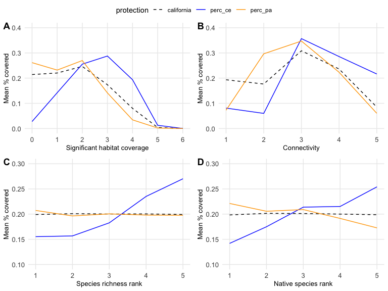
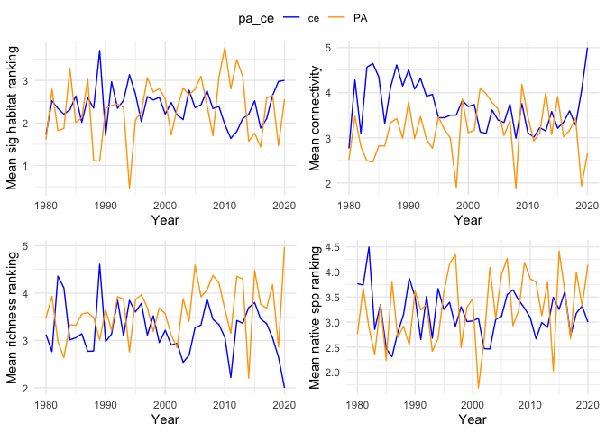

wdpa
================
Millie Chapman
2/21/2020

``` r
cpad <- st_read("../data/CPAD_2020a/CPAD_2020a_Units.shp")
```

    ## Reading layer `CPAD_2020a_Units' from data source `/Users/milliechapman/Desktop/Berkeley/wdpa-hotspots/wdpa-hotspots/data/CPAD_2020a/CPAD_2020a_Units.shp' using driver `ESRI Shapefile'
    ## Simple feature collection with 17068 features and 21 fields
    ## geometry type:  MULTIPOLYGON
    ## dimension:      XY
    ## bbox:           xmin: -374984.2 ymin: -604454.8 xmax: 540016.3 ymax: 449743.2
    ## epsg (SRID):    3310
    ## proj4string:    +proj=aea +lat_1=34 +lat_2=40.5 +lat_0=0 +lon_0=-120 +x_0=0 +y_0=-4000000 +ellps=GRS80 +towgs84=0,0,0,0,0,0,0 +units=m +no_defs

``` r
cpad %>% filter(YR_EST >1990) %>% select(UNIT_ID)  %>%plot()
```

<!-- -->

``` r
cced <- st_read("../data/CCED_2020a/CCED_2020a.shp")
```

    ## Reading layer `CCED_2020a' from data source `/Users/milliechapman/Desktop/Berkeley/wdpa-hotspots/wdpa-hotspots/data/CCED_2020a/CCED_2020a.shp' using driver `ESRI Shapefile'
    ## Simple feature collection with 12297 features and 25 fields
    ## geometry type:  MULTIPOLYGON
    ## dimension:      XYZ
    ## bbox:           xmin: -368046.7 ymin: -603668.6 xmax: 493109 ymax: 444116.4
    ## z_range:        zmin: 2.273737e-13 zmax: 344.2585
    ## epsg (SRID):    3310
    ## proj4string:    +proj=aea +lat_1=34 +lat_2=40.5 +lat_0=0 +lon_0=-120 +x_0=0 +y_0=-4000000 +ellps=GRS80 +towgs84=0,0,0,0,0,0,0 +units=m +no_defs

``` r
cced %>% filter(year_est >1990) %>% select(cced_id) %>% plot()
```

<!-- -->

``` r
sig_hab <- st_read("../data/Terrestrial_Significant_Habitats_Summary_-_ACE_[ds2721]-shp/Terrestrial_Significant_Habitats_Summary_-_ACE_[ds2721].shp")
```

    ## Reading layer `Terrestrial_Significant_Habitats_Summary_-_ACE_[ds2721]' from data source `/Users/milliechapman/Desktop/Berkeley/wdpa-hotspots/wdpa-hotspots/data/Terrestrial_Significant_Habitats_Summary_-_ACE_[ds2721]-shp/Terrestrial_Significant_Habitats_Summary_-_ACE_[ds2721].shp' using driver `ESRI Shapefile'
    ## Simple feature collection with 60000 features and 25 fields
    ## geometry type:  MULTIPOLYGON
    ## dimension:      XY
    ## bbox:           xmin: -124.4098 ymin: 32.53429 xmax: -114.1312 ymax: 42.00934
    ## epsg (SRID):    4326
    ## proj4string:    +proj=longlat +datum=WGS84 +no_defs

``` r
sig_hab <- as.tibble(sig_hab) %>%
  select(Hex_ID, TerrHabRan, TerrHabTot)
```

    ## Warning: `as.tibble()` is deprecated, use `as_tibble()` (but mind the new semantics).
    ## This warning is displayed once per session.

``` r
connectivity <- st_read("../data/Terrestrial_Connectivity_-_ACE_[ds2734]-shp/")
```

    ## Reading layer `Terrestrial_Connectivity_-_ACE_[ds2734]' from data source `/Users/milliechapman/Desktop/Berkeley/wdpa-hotspots/wdpa-hotspots/data/Terrestrial_Connectivity_-_ACE_[ds2734]-shp' using driver `ESRI Shapefile'
    ## Simple feature collection with 63890 features and 15 fields
    ## geometry type:  MULTIPOLYGON
    ## dimension:      XY
    ## bbox:           xmin: -124.4098 ymin: 32.53429 xmax: -114.1312 ymax: 42.00934
    ## epsg (SRID):    4326
    ## proj4string:    +proj=longlat +datum=WGS84 +no_defs

``` r
connectivity %>% filter(County == "ALAMEDA") %>% select(OBJECTID) %>% plot()
```

<!-- -->

transform

``` r
cced <- st_transform(cced, 4326)
cpad <- st_transform(cpad, 4326)
```

``` r
int_c_pa <- as_tibble(st_intersection(connectivity, cpad))
```

    ## although coordinates are longitude/latitude, st_intersection assumes that they are planar

    ## Warning: attribute variables are assumed to be spatially constant throughout all
    ## geometries

``` r
int_c_pa %>% filter(County == "MONTEREY") %>% select(geometry) %>% plot()
```

    ## Warning in if (cl %in% c("integer", "numeric")) stripchart(x1, ...) else
    ## plot(x1, : the condition has length > 1 and only the first element will be used

<!-- -->

``` r
ccedb<- st_buffer(cced, dist = 0)
```

    ## Warning in st_buffer.sfc(st_geometry(x), dist, nQuadSegs, endCapStyle =
    ## endCapStyle, : st_buffer does not correctly buffer longitude/latitude data

    ## dist is assumed to be in decimal degrees (arc_degrees).

``` r
int_c_ce <- as_tibble(st_intersection(connectivity, ccedb))
```

    ## although coordinates are longitude/latitude, st_intersection assumes that they are planar

    ## Warning: attribute variables are assumed to be spatially constant throughout all
    ## geometries

``` r
int_c_ce %>% filter(County == "ALAMEDA") %>% select(geometry) %>% plot()
```

    ## Warning in if (cl %in% c("integer", "numeric")) stripchart(x1, ...) else
    ## plot(x1, : the condition has length > 1 and only the first element will be used

<!-- -->

``` r
int_c_ce$ce_area<- st_area(int_c_ce$geometry)

int_c_pa$pa_area<- st_area(int_c_pa$geometry)
```

``` r
biodiversity <- st_read("../data/Species_Biodiversity_-_ACE_%5Bds2769%5D-shp/Species_Biodiversity_-_ACE_%5Bds2769%5D.shp")
```

    ## Reading layer `Species_Biodiversity_-_ACE_%5Bds2769%5D' from data source `/Users/milliechapman/Desktop/Berkeley/wdpa-hotspots/wdpa-hotspots/data/Species_Biodiversity_-_ACE_%5Bds2769%5D-shp/Species_Biodiversity_-_ACE_%5Bds2769%5D.shp' using driver `ESRI Shapefile'
    ## Simple feature collection with 121901 features and 35 fields
    ## geometry type:  MULTIPOLYGON
    ## dimension:      XY
    ## bbox:           xmin: -124.4098 ymin: 32.53429 xmax: -114.1308 ymax: 42.0095
    ## epsg (SRID):    4326
    ## proj4string:    +proj=longlat +datum=WGS84 +no_defs

``` r
biodiversity <- as.tibble(biodiversity) 

biodiv <- biodiversity %>%
  select(Hex_ID, NtvSpRnkEc, RarRnkEco, TerrClimRa, SpBioRnkEc)
```

``` r
paArea <- int_c_pa %>%
  group_by(Hex_ID) %>%  
  mutate(pa_area = as.numeric(pa_area)) %>%
  summarise(paArea = sum(pa_area))

ceArea <- int_c_ce %>%
  group_by(Hex_ID) %>%
  mutate(ce_area = as.numeric(ce_area)) %>%
  summarise(ceArea = sum(ce_area))
```

``` r
all <- connectivity %>%
  left_join(ceArea) %>%
  left_join(paArea) 
```

    ## Joining, by = "Hex_ID"
    ## Joining, by = "Hex_ID"

``` r
all$tot_area <- st_area(all$geometry)

all <- all %>%
  mutate(tot_area = as.numeric(tot_area)) 

all <- all %>%
  left_join(sig_hab) %>%
  left_join(biodiv) %>%
  mutate(perc_pa = paArea/tot_area,
         perc_ce = ceArea/tot_area) %>%
  mutate(perc_pa = replace_na(perc_pa, 0),
         perc_ce = replace_na(perc_ce, 0))
```

    ## Joining, by = "Hex_ID"
    ## Joining, by = "Hex_ID"

``` r
areace <- sum(all$ceArea, na.rm = TRUE)
areapa <- sum(all$paArea, na.rm = TRUE)
areaca <- sum(all$tot_area, na.rm = TRUE)
```

``` r
habitat_total <- as.tibble(all) %>% select(TerrHabTot, paArea, ceArea, tot_area) %>%
  group_by(TerrHabTot) %>%
  summarise(perc_pa = sum(paArea, na.rm = TRUE)/areapa,
            perc_ce = sum(ceArea, na.rm = TRUE)/areace,
            california = sum(tot_area)/areaca) %>%
  pivot_longer(-TerrHabTot, names_to = "protection", values_to = "percent_area")
```

``` r
connectivity_total <- as.tibble(all) %>% select(Connectivi, paArea, ceArea, tot_area) %>%
  group_by(Connectivi) %>%
  summarise(perc_pa = sum(paArea, na.rm = TRUE)/areapa,
            perc_ce = sum(ceArea, na.rm = TRUE)/areace,
            california = sum(tot_area)/areaca) %>%
  pivot_longer(-Connectivi, names_to = "protection", values_to = "percent_area")
```

``` r
richness_total <- as.tibble(all) %>% select(SpBioRnkEc, paArea, ceArea, tot_area) %>%
  group_by(SpBioRnkEc) %>%
  summarise(perc_pa = sum(paArea, na.rm = TRUE)/areapa,
            perc_ce = sum(ceArea, na.rm = TRUE)/areace,
            california = sum(tot_area)/areaca) %>%
  pivot_longer(-SpBioRnkEc, names_to = "protection", values_to = "percent_area")
```

``` r
nativesp_total <- as.tibble(all) %>% select(NtvSpRnkEc, paArea, ceArea, tot_area) %>%
  group_by(NtvSpRnkEc) %>%
  summarise(perc_pa = sum(paArea, na.rm = TRUE)/areapa,
            perc_ce = sum(ceArea, na.rm = TRUE)/areace,
            california = sum(tot_area)/areaca) %>%
  pivot_longer(-NtvSpRnkEc, names_to = "protection", values_to = "percent_area")
```

``` r
h <- habitat_total %>% ggplot(aes(x = TerrHabTot, y = percent_area, color = protection))  + 
  geom_line(aes(linetype=protection)) + theme_minimal() + scale_color_manual(values=c("black", "blue", "orange")) +   scale_linetype_manual(values=c("dashed", "solid", "solid"))+
  labs( x="Total significant habitat coverage count", y = "Mean percent covered \n by protected areas")

c <-connectivity_total %>% ggplot(aes(x = Connectivi, y = percent_area, color = protection))  + 
  geom_line(aes(linetype=protection)) + theme_minimal() + scale_color_manual(values=c("black", "blue", "orange")) +   scale_linetype_manual(values=c("dashed", "solid", "solid"))+
  labs( x="Total significant connectivity", y = "Mean percent covered \n by protected areas")

r <-richness_total %>% ggplot(aes(x = SpBioRnkEc, y = percent_area, color = protection))  + 
  geom_line(aes(linetype=protection)) + theme_minimal() + scale_color_manual(values=c("black", "blue", "orange")) +   scale_linetype_manual(values=c("dashed", "solid", "solid"))+
  labs( x="Total significant SpBioRnkEc", y = "Mean percent covered \n by protected areas")
 
n <-nativesp_total %>% ggplot(aes(x = NtvSpRnkEc, y = percent_area, color = protection))  + 
  geom_line(aes(linetype=protection)) + theme_minimal() + scale_color_manual(values=c("black", "blue", "orange")) +   scale_linetype_manual(values=c("dashed", "solid", "solid"))+
  labs( x="Total significant SpBioRnkEc", y = "Mean percent covered \n by protected areas")

ggarrange(h,c,r,n, ncol = 2, nrow = 2, common.legend = TRUE)
```

    ## Warning: Removed 3 row(s) containing missing values (geom_path).
    
    ## Warning: Removed 3 row(s) containing missing values (geom_path).

<!-- -->

``` r
int_c_pa_all <- int_c_pa %>%
  full_join(as.tibble(biodiv)) %>%
  full_join(as.tibble(sig_hab)) %>%
  mutate(TerrHabTot = replace_na(TerrHabTot, 0))
```

    ## Joining, by = "Hex_ID"
    ## Joining, by = "Hex_ID"

``` r
int_c_ce_all <- int_c_ce %>%
  left_join(biodiv, by = "Hex_ID") %>%
  left_join(sig_hab, by = "Hex_ID") %>%
  mutate(TerrHabTot = replace_na(TerrHabTot, 0))


paArea_yr <- int_c_pa_all %>% 
  mutate(pa_area = as.numeric(pa_area)) %>%
  group_by(UNIT_ID, YR_EST) %>%  
  summarise(paArea = sum(pa_area),
            connectivity = mean(Connectivi),
            sig_hab = mean(TerrHabTot),
            richness = mean(SpBioRnkEc),
            nativesp = mean(NtvSpRnkEc)) %>%
  filter(YR_EST > 1979) %>%
 # mutate(area_connect = paArea*connectivity) %>%
  group_by(YR_EST) %>%
  summarise(connectivity = sum(paArea*connectivity),
            sig_hab = sum(paArea*sig_hab),
            richness = sum(paArea*richness),
            nativesp = sum(paArea*nativesp),
            paArea = sum(paArea)) %>%
  mutate(mean_connect = connectivity/paArea,
         mean_sighab = sig_hab/paArea,
         mean_richness = richness/paArea,
         mean_nativesp = nativesp/paArea,
         pa_ce = "PA") %>%
  select(YR_EST, mean_connect, mean_sighab,
         mean_nativesp,mean_richness, pa_ce)


ceArea_yr <- int_c_ce_all %>%
  mutate(ce_area = as.numeric(ce_area)) %>%
  group_by(cced_id, year_est) %>%  
  summarise(ceArea = sum(ce_area),
            connectivity = mean(Connectivi),
            sig_hab = mean(TerrHabTot),
            richness = mean(SpBioRnkEc),
            nativesp = mean(NtvSpRnkEc)) %>%
  filter(year_est > 1979) %>%
  mutate(YR_EST = year_est) %>%
  group_by(YR_EST) %>%
  summarise(connectivity = sum(ceArea*connectivity),
            sig_hab = sum(ceArea*sig_hab),
            richness = sum(ceArea*richness),
            nativesp = sum(ceArea*nativesp),
            ceArea = sum(ceArea)) %>%
  mutate(mean_connect = connectivity/ceArea,
         mean_sighab = sig_hab/ceArea,
         mean_richness = richness/ceArea,
         mean_nativesp = nativesp/ceArea,
         pa_ce = "ce") %>%
  select(YR_EST, mean_connect, mean_sighab,
         mean_nativesp,mean_richness, pa_ce)


metrics_yr <- ceArea_yr %>% 
  bind_rows(paArea_yr) 
```

``` r
c_yr <- metrics_yr %>%
  ggplot(aes(x = YR_EST, y = mean_connect, color = pa_ce))  + 
  geom_line() + theme_minimal() + scale_color_manual(values=c("blue", "orange")) +   
  labs( x="Year", y = "Mean connectivity")

n_yr <- metrics_yr %>%
  ggplot(aes(x = YR_EST, y = mean_nativesp, color = pa_ce))  + 
  geom_line() + theme_minimal() + scale_color_manual(values=c("blue", "orange")) +   
  labs( x="Year", y = "Mean native spp ranking")

r_yr <- metrics_yr %>% 
  ggplot(aes(x = YR_EST, y = mean_richness, color = pa_ce))  + 
  geom_line() + theme_minimal() + scale_color_manual(values=c("blue", "orange")) +   
  labs( x="Year", y = "Mean richness ranking")

h_yr <- metrics_yr %>% 
  ggplot(aes(x = YR_EST, y = mean_sighab, color = pa_ce))  + 
  geom_line() + theme_minimal() + scale_color_manual(values=c("blue", "orange")) +   
  labs( x="Year", y = "Mean sig habitat ranking")

ggarrange(h_yr,c_yr,r_yr,n_yr, ncol = 2, nrow = 2, common.legend = TRUE)
```

<!-- -->
