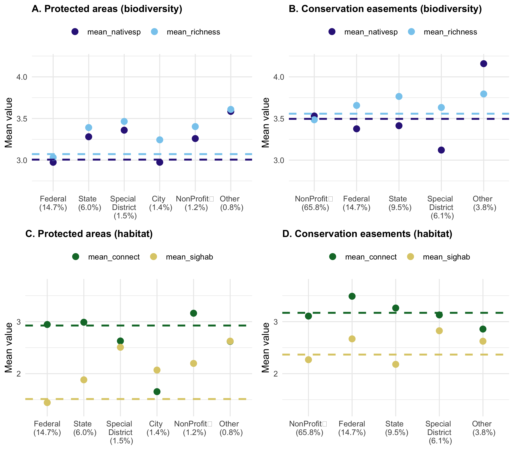

wdpa
================
Millie Chapman
2/21/2020

``` r
cpad <- st_read("../data/CPAD_2020a/CPAD_2020a_Units.shp")
```

    ## Reading layer `CPAD_2020a_Units' from data source `/Users/milliechapman/Desktop/Berkeley/wdpa-hotspots/wdpa-hotspots/data/CPAD_2020a/CPAD_2020a_Units.shp' using driver `ESRI Shapefile'
    ## Simple feature collection with 17068 features and 21 fields
    ## geometry type:  MULTIPOLYGON
    ## dimension:      XY
    ## bbox:           xmin: -374984.2 ymin: -604454.8 xmax: 540016.3 ymax: 449743.2
    ## epsg (SRID):    3310
    ## proj4string:    +proj=aea +lat_1=34 +lat_2=40.5 +lat_0=0 +lon_0=-120 +x_0=0 +y_0=-4000000 +ellps=GRS80 +towgs84=0,0,0,0,0,0,0 +units=m +no_defs

``` r
cpad %>% filter(YR_EST >1990) %>% select(UNIT_ID)  %>%plot()
```

<!-- -->

``` r
cced <- st_read("../data/CCED_2020a/CCED_2020a.shp")
```

    ## Reading layer `CCED_2020a' from data source `/Users/milliechapman/Desktop/Berkeley/wdpa-hotspots/wdpa-hotspots/data/CCED_2020a/CCED_2020a.shp' using driver `ESRI Shapefile'
    ## Simple feature collection with 12297 features and 25 fields
    ## geometry type:  MULTIPOLYGON
    ## dimension:      XYZ
    ## bbox:           xmin: -368046.7 ymin: -603668.6 xmax: 493109 ymax: 444116.4
    ## z_range:        zmin: 2.273737e-13 zmax: 344.2585
    ## epsg (SRID):    3310
    ## proj4string:    +proj=aea +lat_1=34 +lat_2=40.5 +lat_0=0 +lon_0=-120 +x_0=0 +y_0=-4000000 +ellps=GRS80 +towgs84=0,0,0,0,0,0,0 +units=m +no_defs

``` r
cced %>% filter(year_est >1990) %>% select(cced_id) %>% plot()
```

<!-- -->

``` r
sig_hab <- st_read("../data/Terrestrial_Significant_Habitats_Summary_-_ACE_[ds2721]-shp/Terrestrial_Significant_Habitats_Summary_-_ACE_[ds2721].shp")
```

    ## Reading layer `Terrestrial_Significant_Habitats_Summary_-_ACE_[ds2721]' from data source `/Users/milliechapman/Desktop/Berkeley/wdpa-hotspots/wdpa-hotspots/data/Terrestrial_Significant_Habitats_Summary_-_ACE_[ds2721]-shp/Terrestrial_Significant_Habitats_Summary_-_ACE_[ds2721].shp' using driver `ESRI Shapefile'
    ## Simple feature collection with 60000 features and 25 fields
    ## geometry type:  MULTIPOLYGON
    ## dimension:      XY
    ## bbox:           xmin: -124.4098 ymin: 32.53429 xmax: -114.1312 ymax: 42.00934
    ## epsg (SRID):    4326
    ## proj4string:    +proj=longlat +datum=WGS84 +no_defs

``` r
sig_hab <- as.tibble(sig_hab) %>%
  select(Hex_ID, TerrHabRan, TerrHabTot)
```

    ## Warning: `as.tibble()` is deprecated, use `as_tibble()` (but mind the new semantics).
    ## This warning is displayed once per session.

``` r
connectivity <- st_read("../data/Terrestrial_Connectivity_-_ACE_[ds2734]-shp/")
```

    ## Reading layer `Terrestrial_Connectivity_-_ACE_[ds2734]' from data source `/Users/milliechapman/Desktop/Berkeley/wdpa-hotspots/wdpa-hotspots/data/Terrestrial_Connectivity_-_ACE_[ds2734]-shp' using driver `ESRI Shapefile'
    ## Simple feature collection with 63890 features and 15 fields
    ## geometry type:  MULTIPOLYGON
    ## dimension:      XY
    ## bbox:           xmin: -124.4098 ymin: 32.53429 xmax: -114.1312 ymax: 42.00934
    ## epsg (SRID):    4326
    ## proj4string:    +proj=longlat +datum=WGS84 +no_defs

``` r
connectivity %>% filter(County == "ALAMEDA") %>% select(OBJECTID) %>% plot()
```

<!-- -->

transform

``` r
cced <- st_transform(cced, 4326)
cpad <- st_transform(cpad, 4326)
```

``` r
int_c_pa <- as_tibble(st_intersection(connectivity, cpad))
```

    ## although coordinates are longitude/latitude, st_intersection assumes that they are planar

    ## Warning: attribute variables are assumed to be spatially constant throughout all
    ## geometries

``` r
int_c_pa %>% filter(County == "MONTEREY") %>% select(geometry) %>% plot()
```

    ## Warning in if (cl %in% c("integer", "numeric")) stripchart(x1, ...) else
    ## plot(x1, : the condition has length > 1 and only the first element will be used

<!-- -->

``` r
ccedb<- st_buffer(cced, dist = 0)
```

    ## Warning in st_buffer.sfc(st_geometry(x), dist, nQuadSegs, endCapStyle =
    ## endCapStyle, : st_buffer does not correctly buffer longitude/latitude data

    ## dist is assumed to be in decimal degrees (arc_degrees).

``` r
int_c_ce <- as_tibble(st_intersection(connectivity, ccedb))
```

    ## although coordinates are longitude/latitude, st_intersection assumes that they are planar

    ## Warning: attribute variables are assumed to be spatially constant throughout all
    ## geometries

``` r
int_c_ce %>% filter(County == "ALAMEDA") %>% select(geometry) %>% plot()
```

    ## Warning in if (cl %in% c("integer", "numeric")) stripchart(x1, ...) else
    ## plot(x1, : the condition has length > 1 and only the first element will be used

<!-- -->

``` r
int_c_ce$ce_area<- st_area(int_c_ce$geometry)

int_c_pa$pa_area<- st_area(int_c_pa$geometry)
```

``` r
biodiversity <- st_read("../data/Species_Biodiversity_-_ACE_%5Bds2769%5D-shp/Species_Biodiversity_-_ACE_%5Bds2769%5D.shp")
```

    ## Reading layer `Species_Biodiversity_-_ACE_%5Bds2769%5D' from data source `/Users/milliechapman/Desktop/Berkeley/wdpa-hotspots/wdpa-hotspots/data/Species_Biodiversity_-_ACE_%5Bds2769%5D-shp/Species_Biodiversity_-_ACE_%5Bds2769%5D.shp' using driver `ESRI Shapefile'
    ## Simple feature collection with 121901 features and 35 fields
    ## geometry type:  MULTIPOLYGON
    ## dimension:      XY
    ## bbox:           xmin: -124.4098 ymin: 32.53429 xmax: -114.1308 ymax: 42.0095
    ## epsg (SRID):    4326
    ## proj4string:    +proj=longlat +datum=WGS84 +no_defs

``` r
biodiversity <- as.tibble(biodiversity) 
```

    ## Warning: `as.tibble()` is deprecated, use `as_tibble()` (but mind the new semantics).
    ## This warning is displayed once per session.

``` r
biodiv <- biodiversity %>%
  select(Hex_ID, NtvSpRnkEc, RarRnkEco, TerrClimRa, SpBioRnkEc)
```

``` r
paArea <- int_c_pa %>%
  group_by(Hex_ID) %>%  
  mutate(pa_area = as.numeric(pa_area)) %>%
  summarise(paArea = sum(pa_area))

ceArea <- int_c_ce %>%
  group_by(Hex_ID) %>%
  mutate(ce_area = as.numeric(ce_area)) %>%
  summarise(ceArea = sum(ce_area))
```

``` r
all <- connectivity %>%
  left_join(ceArea) %>%
  left_join(paArea) 
```

    ## Joining, by = "Hex_ID"
    ## Joining, by = "Hex_ID"

``` r
all$tot_area <- st_area(all$geometry)

all <- all %>%
  mutate(tot_area = as.numeric(tot_area)) 

all <- all %>%
  left_join(sig_hab) %>%
  left_join(biodiv) %>%
  mutate(perc_pa = paArea/tot_area,
         perc_ce = ceArea/tot_area) %>%
  mutate(perc_pa = replace_na(perc_pa, 0),
         perc_ce = replace_na(perc_ce, 0))
```

    ## Joining, by = "Hex_ID"
    ## Joining, by = "Hex_ID"

``` r
areace <- sum(all$ceArea, na.rm = TRUE)
areapa <- sum(all$paArea, na.rm = TRUE)
areaca <- sum(all$tot_area, na.rm = TRUE)
```

``` r
habitat_total <- as.tibble(all) %>% select(TerrHabTot, paArea, ceArea, tot_area) %>%
  group_by(TerrHabTot) %>%
  summarise(perc_pa = sum(paArea, na.rm = TRUE)/areapa,
            perc_ce = sum(ceArea, na.rm = TRUE)/areace,
            california = sum(tot_area)/areaca) %>%
  pivot_longer(-TerrHabTot, names_to = "protection", values_to = "percent_area") %>%
  mutate(protection = recode(protection, perc_pa = "Protected area", perc_ce = "Conservation Easement", california = "All of California"))
```

``` r
connectivity_total <- as.tibble(all) %>% select(Connectivi, paArea, ceArea, tot_area) %>%
  group_by(Connectivi) %>%
  summarise(perc_pa = sum(paArea, na.rm = TRUE)/areapa,
            perc_ce = sum(ceArea, na.rm = TRUE)/areace,
            california = sum(tot_area)/areaca) %>%
  pivot_longer(-Connectivi, names_to = "protection", values_to = "percent_area") %>%
  mutate(protection = recode(protection, perc_pa = "Protected area", perc_ce = "Conservation Easement", california = "All of California"))
```

``` r
richness_total <- as.tibble(all) %>% select(SpBioRnkEc, paArea, ceArea, tot_area) %>%
  group_by(SpBioRnkEc) %>%
  summarise(perc_pa = sum(paArea, na.rm = TRUE)/areapa,
            perc_ce = sum(ceArea, na.rm = TRUE)/areace,
            california = sum(tot_area)/areaca) %>%
  pivot_longer(-SpBioRnkEc, names_to = "protection", values_to = "percent_area") %>%
  mutate(protection = recode(protection, perc_pa = "Protected area", perc_ce = "Conservation Easement", california = "All of California"))
```

``` r
nativesp_total <- as.tibble(all) %>% select(NtvSpRnkEc, paArea, ceArea, tot_area) %>%
  group_by(NtvSpRnkEc) %>%
  summarise(perc_pa = sum(paArea, na.rm = TRUE)/areapa,
            perc_ce = sum(ceArea, na.rm = TRUE)/areace,
            california = sum(tot_area)/areaca) %>%
  pivot_longer(-NtvSpRnkEc, names_to = "protection", values_to = "percent_area")  %>%
  mutate(protection = recode(protection, perc_pa = "Protected area", perc_ce = "Conservation Easement", california = "All of California"))
```

``` r
h <- habitat_total %>% ggplot(aes(x = TerrHabTot, y = percent_area, color = protection))  + 
  geom_line(aes(linetype=protection)) + theme_minimal() + scale_color_manual(values=c("black", "blue", "orange")) +   scale_linetype_manual(values=c("dashed", "solid", "solid"))+
  labs( x="Significant habitat coverage", y = "Mean % covered")+ 
  ylim(0, .4) + scale_x_continuous(breaks=seq(0,6,1)) +
  theme(panel.grid.minor.x = element_blank(),
        panel.grid.minor.y = element_blank()) +
  theme(axis.text=element_text(size=10),
        axis.title=element_text(size=10)) +
   theme(legend.title = element_blank())


c <-connectivity_total %>% ggplot(aes(x = Connectivi, y = percent_area, color = protection))  + 
  geom_line(aes(linetype=protection)) + theme_minimal() + scale_color_manual(values=c("black", "blue", "orange")) +   scale_linetype_manual(values=c("dashed", "solid", "solid"))+
  labs( x="Connectivity", y = "Mean % covered") +
    ylim(0, .4)+
    theme(panel.grid.minor.x = element_blank(),
        panel.grid.minor.y = element_blank()) +
  theme(axis.text=element_text(size=10),
        axis.title=element_text(size=10))+
   theme(legend.title = element_blank())


r <-richness_total %>% ggplot(aes(x = SpBioRnkEc, y = percent_area, color = protection))  + 
  geom_line(aes(linetype=protection)) + theme_minimal() + scale_color_manual(values=c("black", "blue", "orange")) +   scale_linetype_manual(values=c("dashed", "solid", "solid"))+
  labs( x="Species richness rank", y = "Mean % covered")+
    ylim(0.1, .3)+
    theme(panel.grid.minor.x = element_blank(),
        panel.grid.minor.y = element_blank()) +
  theme(axis.text=element_text(size=10),
        axis.title=element_text(size=10))+
   theme(legend.title = element_blank())


 
n <-nativesp_total %>% ggplot(aes(x = NtvSpRnkEc, y = percent_area, color = protection))  + 
  geom_line(aes(linetype=protection)) + theme_minimal() + scale_color_manual(values=c("black", "blue", "orange")) +   scale_linetype_manual(values=c("dashed", "solid", "solid"))+
  labs( x="Native species rank", y = "Mean % covered") +
    ylim(0.1, .3)+
    theme(panel.grid.minor.x = element_blank(),
        panel.grid.minor.y = element_blank()) +
  theme(axis.text=element_text(size=10),
        axis.title=element_text(size=10),
        title = element_text(size=10)) +
  theme(legend.title = element_blank())


ggarrange(h,c,r,n, ncol = 2, nrow = 2, common.legend = TRUE,labels = c("A", "B", "C", "D")
)
```

    ## Warning: Removed 3 row(s) containing missing values (geom_path).
    
    ## Warning: Removed 3 row(s) containing missing values (geom_path).

<!-- -->

``` r
int_c_pa_all <- int_c_pa %>%
  full_join(as.tibble(biodiv)) %>%
  full_join(as.tibble(sig_hab)) %>%
  mutate(TerrHabTot = replace_na(TerrHabTot, 0))
```

    ## Joining, by = "Hex_ID"
    ## Joining, by = "Hex_ID"

``` r
int_c_ce_all <- int_c_ce %>%
  left_join(biodiv, by = "Hex_ID") %>%
  left_join(sig_hab, by = "Hex_ID") %>%
  mutate(TerrHabTot = replace_na(TerrHabTot, 0))


paArea_yr <- int_c_pa_all %>% 
  mutate(pa_area = as.numeric(pa_area)) %>%
  group_by(UNIT_ID, YR_EST) %>%  
  summarise(paArea = sum(pa_area),
            connectivity = mean(Connectivi),
            sig_hab = mean(TerrHabTot),
            richness = mean(SpBioRnkEc),
            nativesp = mean(NtvSpRnkEc)) %>%
  filter(YR_EST > 1979) %>%
 # mutate(area_connect = paArea*connectivity) %>%
  group_by(YR_EST) %>%
  summarise(connectivity = sum(paArea*connectivity),
            sig_hab = sum(paArea*sig_hab),
            richness = sum(paArea*richness),
            nativesp = sum(paArea*nativesp),
            paArea = sum(paArea)) %>%
  mutate(mean_connect = connectivity/paArea,
         mean_sighab = sig_hab/paArea,
         mean_richness = richness/paArea,
         mean_nativesp = nativesp/paArea,
         pa_ce = "Protected areas") %>%
  select(YR_EST, mean_connect, mean_sighab,
         mean_nativesp,mean_richness, pa_ce)


ceArea_yr <- int_c_ce_all %>%
  mutate(ce_area = as.numeric(ce_area)) %>%
  group_by(cced_id, year_est) %>%  
  summarise(ceArea = sum(ce_area),
            connectivity = mean(Connectivi),
            sig_hab = mean(TerrHabTot),
            richness = mean(SpBioRnkEc),
            nativesp = mean(NtvSpRnkEc)) %>%
  filter(year_est > 1979) %>%
  mutate(YR_EST = year_est) %>%
  group_by(YR_EST) %>%
  summarise(connectivity = sum(ceArea*connectivity),
            sig_hab = sum(ceArea*sig_hab),
            richness = sum(ceArea*richness),
            nativesp = sum(ceArea*nativesp),
            ceArea = sum(ceArea)) %>%
  mutate(mean_connect = connectivity/ceArea,
         mean_sighab = sig_hab/ceArea,
         mean_richness = richness/ceArea,
         mean_nativesp = nativesp/ceArea,
         pa_ce = "Conservation easements") %>%
  select(YR_EST, mean_connect, mean_sighab,
         mean_nativesp,mean_richness, pa_ce) 

metrics_yr <- ceArea_yr %>% 
  bind_rows(paArea_yr) 
```

``` r
c_yr <- metrics_yr %>%
  ggplot(aes(x = YR_EST, y = mean_connect, color = pa_ce))  + 
  geom_line() + theme_minimal() + scale_color_manual(values=c("blue", "orange")) +   
  labs( x="Year", y = "Mean connectivity") +
  geom_vline(xintercept  = 2000, linetype="dotted") +
  theme(panel.grid.minor.x = element_blank(),
        panel.grid.minor.y = element_blank()) +
  theme(axis.text=element_text(size=10),
        axis.title=element_text(size=10),
        title = element_text(size=10)) +
    theme(legend.title = element_blank()) +ylim(0,5)


n_yr <- metrics_yr %>%
  ggplot(aes(x = YR_EST, y = mean_nativesp, color = pa_ce))  + 
  geom_line() + theme_minimal() + scale_color_manual(values=c("blue", "orange")) +   
  labs( x="Year", y = "Mean native spp ranking") +
  geom_vline(xintercept  = 2000, linetype="dotted")+
  theme(panel.grid.minor.x = element_blank(),
        panel.grid.minor.y = element_blank()) +
  theme(axis.text=element_text(size=10),
        axis.title=element_text(size=10),
        title = element_text(size=10))+
    theme(legend.title = element_blank()) +ylim(0,5)


r_yr <- metrics_yr %>% 
  ggplot(aes(x = YR_EST, y = mean_richness, color = pa_ce))  + 
  geom_line() + theme_minimal() + scale_color_manual(values=c("blue", "orange")) +   
  labs( x="Year", y = "Mean richness ranking") +
  geom_vline(xintercept  = 2000, linetype="dotted")+
  theme(panel.grid.minor.x = element_blank(),
        panel.grid.minor.y = element_blank()) +
  theme(axis.text=element_text(size=10),
        axis.title=element_text(size=10),
        title = element_text(size=10))+
    theme(legend.title = element_blank()) +ylim(0,5)


h_yr <- metrics_yr %>% 
  ggplot(aes(x = YR_EST, y = mean_sighab, color = pa_ce))  + 
  geom_line() + theme_minimal() + scale_color_manual(values=c("blue", "orange")) +   
  labs( x="Year", y = "Mean habitat ranking") +
  geom_vline(xintercept  = 2000, linetype="dotted")+
  theme(panel.grid.minor.x = element_blank(),
        panel.grid.minor.y = element_blank()) +
  theme(axis.text=element_text(size=10),
        axis.title=element_text(size=10),
        title = element_text(size=10))+
    theme(legend.title = element_blank()) +ylim(0,5)

ggarrange(h_yr,c_yr,r_yr,n_yr, ncol = 2, nrow = 2, common.legend = TRUE, labels = c("A", "B", "C", "D"))
```

<!-- -->

``` r
paArea_hld <- int_c_pa_all %>%
  mutate(pa_area = as.numeric(pa_area))

pa_Area_total <- sum(paArea_hld$pa_area, na.rm = TRUE)

paArea_hld <- paArea_hld %>% 
  group_by(AGNCY_LEV) %>%  
  summarise(paArea = sum(pa_area)/pa_Area_total,
            connectivity = mean(Connectivi),
            sig_hab = mean(TerrHabTot),
            richness = mean(SpBioRnkEc),
            nativesp = mean(NtvSpRnkEc)) %>%
 # mutate(area_connect = paArea*connectivity) %>%
  mutate(AGNCY_LEV = ifelse(paArea < 0.01,"Other", paste(AGNCY_LEV))) %>%
  group_by(AGNCY_LEV) %>%  
  summarise(connectivity = sum(paArea*connectivity),
            sig_hab = sum(paArea*sig_hab),
            richness = sum(paArea*richness),
            nativesp = sum(paArea*nativesp),
            paArea = sum(paArea)) %>%
  mutate(mean_connect = connectivity/paArea,
         mean_sighab = sig_hab/paArea,
         mean_richness = richness/paArea,
         mean_nativesp = nativesp/paArea,
         pa_ce = "Protected areas",
         Area = paArea) %>%
  select(AGNCY_LEV, mean_connect, mean_sighab,
         mean_nativesp,mean_richness, pa_ce, Area) %>% remove_missing()
```

    ## Warning: Factor `AGNCY_LEV` contains implicit NA, consider using
    ## `forcats::fct_explicit_na`

    ## Warning: Removed 1 rows containing missing values.

``` r
ceArea_hld <- int_c_ce_all %>%
  mutate(ce_area = as.numeric(ce_area))

ce_Area_total <- sum(ceArea_hld$ce_area)

ceArea_hld <-  ceArea_hld %>% group_by(eholdtyp) %>%  
  summarise(ceArea = sum(ce_area)/ce_Area_total,
            connectivity = mean(Connectivi),
            sig_hab = mean(TerrHabTot),
            richness = mean(SpBioRnkEc),
            nativesp = mean(NtvSpRnkEc)) %>%
  mutate(AGNCY_LEV = eholdtyp) %>%
  mutate(AGNCY_LEV = ifelse(ceArea < 0.02,"Other", paste(AGNCY_LEV))) %>%
  group_by(AGNCY_LEV) %>%
  summarise(connectivity = sum(ceArea*connectivity),
            sig_hab = sum(ceArea*sig_hab),
            richness = sum(ceArea*richness),
            nativesp = sum(ceArea*nativesp),
            ceArea = sum(ceArea)) %>%
  mutate(mean_connect = connectivity/ceArea,
         mean_sighab = sig_hab/ceArea,
         mean_richness = richness/ceArea,
         mean_nativesp = nativesp/ceArea,
         pa_ce = "Conservation easements",
         Area = ceArea) %>%
  select(AGNCY_LEV, mean_connect, mean_sighab,
         mean_nativesp,mean_richness, pa_ce, Area) 

metrics_hld<- ceArea_hld %>% 
  bind_rows(paArea_hld) %>%
  pivot_longer(-c(AGNCY_LEV, Area, pa_ce)) %>% 
  mutate(AGNCY_LEV = recode(AGNCY_LEV,
    `Special District` = "Special \n District"
  ))
```

``` r
ce_means<- metrics_hld %>% filter(pa_ce == "Conservation easements") %>%
  mutate(av = Area*value) %>%
  group_by(name) %>%
  summarise(mean = sum(av)/sum(Area))

pa_means<- metrics_hld %>% filter(pa_ce == "Protected areas") %>%
  mutate(av = Area*value) %>%
  group_by(name) %>%
  summarise(mean = sum(av)/sum(Area))
```

``` r
ce_hab <- metrics_hld %>% filter(pa_ce == "Conservation easements" & name == c("mean_connect", "mean_sighab")) %>%
  mutate(AGNCY_LEV = recode(AGNCY_LEV,
     Federal = " Federal \n (14.7%) ",
     NonProfit  = "NonProfit    \n (65.8%)",
     State = "State \n (9.5%)",
     Other = "Other \n (3.8%)",
    `Special \n District` = "Special \n District \n (6.1%)"
  )) %>%
  ggplot(aes(x= reorder(AGNCY_LEV, -Area), y = value, color = name)) + geom_point(size = 3) + #+ geom_bar(stat='identity', position = 'dodge') +
  scale_color_manual(values=c("#117733", "#DDCC77")) + theme_minimal() +
  geom_hline(yintercept = as.numeric(ce_means[1,2]), linetype="dashed", color = "#117733", size =1) +
  geom_hline(yintercept = as.numeric(ce_means[4,2]), linetype="dashed", color = "#DDCC77", size =1) +
  theme(legend.title = element_blank(),
        axis.title.x=element_blank(),
        legend.position="top",
        plot.title = element_text(size = 11, face = "bold"))+ylim(1.3,3.7) +
  ylab("Mean value")+ggtitle("D. Conservation easements (habitat)")

ce_bio <- metrics_hld %>% filter(pa_ce == "Conservation easements" & name == c("mean_nativesp", "mean_richness")) %>%
  mutate(AGNCY_LEV = recode(AGNCY_LEV,
     Federal = " Federal \n (14.7%) ",
     NonProfit  = "NonProfit    \n (65.8%)",
     State = "State \n (9.5%)",
     Other = "Other \n (3.8%)",
    `Special \n District` = "Special \n District \n (6.1%)"
  )) %>%
  ggplot(aes(x= reorder(AGNCY_LEV, -Area), y = value, color = name)) + geom_point(size = 3) + #+ geom_bar(stat='identity', position = 'dodge') +
  scale_color_manual(values=c("#332288", "#88CCEE")) + theme_minimal() +
  geom_hline(yintercept = as.numeric(ce_means[2,2]), linetype="dashed", color = "#332288", size =1) +
  geom_hline(yintercept = as.numeric(ce_means[3,2]), linetype="dashed", color = "#88CCEE", size =1) +
  theme(legend.title = element_blank(),
        axis.title.x=element_blank(),
        legend.position="top",
        plot.title = element_text(size = 11, face = "bold"))+ylim(2.7,4.2) +
  ylab("Mean value") +ggtitle("B. Conservation easements (biodiversity)")

pa_hab <- metrics_hld %>% filter(pa_ce == "Protected areas" &  name == c("mean_connect", "mean_sighab")) %>%
  mutate(AGNCY_LEV = recode(AGNCY_LEV,
     Federal = " Federal \n (14.7%) ",
     `Non Profit`   = "NonProfit    \n (1.2%)",
     State = "State \n (6.0%)",
     Other = "Other \n (0.8%)",
    `Special \n District` = "Special \n District \n (1.5%)",
    City = "City \n (1.4%)"
  )) %>%
  ggplot(aes(x = reorder(AGNCY_LEV, -Area), y = value, color = name)) + geom_point(size = 3)+theme_minimal() +
  scale_color_manual(values=c("#117733", "#DDCC77")) +
  geom_hline(yintercept = as.numeric(pa_means[1,2]), linetype="dashed", color = "#117733", size =1)+
  geom_hline(yintercept = as.numeric(pa_means[4,2]), linetype="dashed", color = "#DDCC77", size =1) +
  theme(legend.title = element_blank(),
        legend.position="top",
        axis.title.x=element_blank(),
        plot.title = element_text(size = 11, face = "bold")) +ylim(1.3,3.7) +
  ylab("Mean value")+ggtitle("C. Protected areas (habitat)")


pa_bio <- metrics_hld %>% filter(pa_ce == "Protected areas" & name == c("mean_nativesp", "mean_richness")) %>%
  mutate(AGNCY_LEV = recode(AGNCY_LEV,
     Federal = " Federal \n (14.7%) ",
     `Non Profit`   = "NonProfit    \n (1.2%)",
     State = "State \n (6.0%)",
     Other = "Other \n (0.8%)",
    `Special \n District` = "Special \n District \n (1.5%)",
    City = "City \n (1.4%)"
  )) %>%
  ggplot(aes(x= reorder(AGNCY_LEV, -Area), y = value, color = name)) + geom_point(size = 3) + #+ geom_bar(stat='identity', position = 'dodge') +
  scale_color_manual(values=c("#332288", "#88CCEE")) + theme_minimal() +
  geom_hline(yintercept = as.numeric(pa_means[2,2]), linetype="dashed", color = "#332288", size =1) +
  geom_hline(yintercept = as.numeric(pa_means[3,2]), linetype="dashed", color = "#88CCEE", size =1) +
  theme(legend.title = element_blank(),
       legend.position="top",
        axis.title.x=element_blank(),
        plot.title = element_text(size = 11, face = "bold"))+ylim(2.7,4.2)+
  ylab("Mean value")+ggtitle("A. Protected areas (biodiversity)")
```

``` r
ggarrange(pa_bio,ce_bio,pa_hab,ce_hab, ncol = 2, nrow = 2, common.legend = FALSE)
```

<!-- -->

``` r
ggarrange(pa_hab,ce_hab, ncol = 2, nrow = 1, common.legend = TRUE)
```

<!-- -->

``` r
ce_duration <- int_c_ce_all %>%
  mutate(ce_area = as.numeric(ce_area))

ce_Area_total <- sum(ce_duration$ce_area)

ce_duration <-  ce_duration %>%   
  mutate(ceArea = ce_area/ce_Area_total) %>%
  group_by(duration) %>%
  summarise(connectivity = sum(ceArea*Connectivi),
            sig_hab = sum(ceArea*TerrHabTot),
            richness = sum(ceArea*SpBioRnkEc),
            nativesp = sum(ceArea*NtvSpRnkEc),
            ceArea = sum(ceArea)) %>%
  mutate(mean_connect = connectivity/ceArea,
         mean_sighab = sig_hab/ceArea,
         mean_richness = richness/ceArea,
         mean_nativesp = nativesp/ceArea,
         pa_ce = "Conservation easements",
         Area = ceArea) %>%
  select(duration, mean_connect, mean_sighab,
         mean_nativesp,mean_richness, pa_ce, Area) 
```

    ## Warning: Factor `duration` contains implicit NA, consider using
    ## `forcats::fct_explicit_na`

``` r
ce_duration %>% filter(duration == "Permanent" | duration =="Temporary" |duration == "Unknown") %>%
  mutate(duration = recode(duration,
                Permanent = "Permanent (25.1%)",
                Temporary = "Temporary (0.6%)",
                Unknown = "Unknown (74.2%)")) %>%
  select(-pa_ce, -Area) %>%
  pivot_longer(-duration) %>%
  mutate(name = recode(name,
                 mean_connect = "Connectivity",
                 mean_sighab = "Significant habitat",
                 mean_richness = "Species richness",
                 mean_nativesp = "Native species rank")) %>%
  ggplot(aes(x = name, y = value, fill = duration)) + geom_bar(stat = "identity", position=position_dodge(width=0.7), width = 0.6) +
  theme_minimal() + scale_fill_manual(values=c('#117733','#E69F00', '#999999')) +
  theme(legend.title = element_blank(),
        axis.title.x=element_blank(),
        plot.title = element_text(size = 11, face = "bold"),
        legend.position="bottom")+
  ylab("mean value")
```

<!-- -->

``` r
paArea_size <- int_c_pa_all %>% 
  mutate(pa_area = as.numeric(pa_area)) %>%
  group_by(UNIT_ID) %>%  
  summarise(paArea = sum(pa_area),
            connectivity = mean(Connectivi),
            sig_hab = mean(TerrHabTot),
            richness = mean(SpBioRnkEc),
            nativesp = mean(NtvSpRnkEc))

paArea_size %>% ggplot(aes(x= log(paArea), y = connectivity)) +geom_point() +  geom_jitter(width = 0.1, height = 0.1)
```

    ## Warning: Removed 1 rows containing missing values (geom_point).
    
    ## Warning: Removed 1 rows containing missing values (geom_point).

<!-- -->

``` r
ggarrange(paArea_size %>% ggplot(aes(x= log(paArea), y = connectivity)) +geom_point() +  geom_jitter(width = 0.1, height = 0.1),
          paArea_size %>% ggplot(aes(x= log(paArea), y = sig_hab)) +geom_point() +  geom_jitter(width = 0.1, height = 0.1),
          paArea_size %>% ggplot(aes(x= log(paArea), y = richness)) +geom_point() +  geom_jitter(width = 0.1, height = 0.1),
          paArea_size %>% ggplot(aes(x= log(paArea), y = nativesp)) +geom_point() +  geom_jitter(width = 0.1, height = 0.1), nrow = 2, ncol = 2
)
```

    ## Warning: Removed 1 rows containing missing values (geom_point).
    
    ## Warning: Removed 1 rows containing missing values (geom_point).
    
    ## Warning: Removed 1 rows containing missing values (geom_point).
    
    ## Warning: Removed 1 rows containing missing values (geom_point).
    
    ## Warning: Removed 1 rows containing missing values (geom_point).
    
    ## Warning: Removed 1 rows containing missing values (geom_point).
    
    ## Warning: Removed 1 rows containing missing values (geom_point).
    
    ## Warning: Removed 1 rows containing missing values (geom_point).

<!-- -->

``` r
ceArea_size <- int_c_ce_all %>%
  mutate(ce_area = as.numeric(ce_area)) %>%
  group_by(cced_id) %>%  
  summarise(ceArea = sum(ce_area),
            connectivity = mean(Connectivi),
            sig_hab = mean(TerrHabTot),
            richness = mean(SpBioRnkEc),
            nativesp = mean(NtvSpRnkEc))

ggarrange(ceArea_size %>% ggplot(aes(x= log(ceArea), y = connectivity)) +geom_point() +  geom_jitter(width = 0.1, height = 0.1),
          ceArea_size %>% ggplot(aes(x= log(ceArea), y = sig_hab)) +geom_point() +  geom_jitter(width = 0.1, height = 0.1),
          ceArea_size %>% ggplot(aes(x= log(ceArea), y = richness)) +geom_point() +  geom_jitter(width = 0.1, height = 0.1),
          ceArea_size %>% ggplot(aes(x= log(ceArea), y = nativesp)) +geom_point() +  geom_jitter(width = 0.1, height = 0.1), nrow = 2, ncol = 2
)
```

<!-- -->
